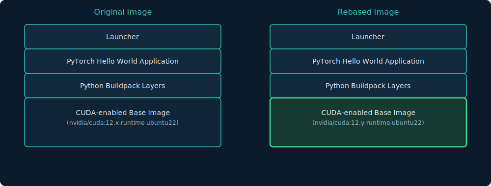

## Who am I {data-background-image="images/bg-content.png"}

:::: {.columns}
::: {.column width="40%"}
* Buildpacks Maintainer
* Academic Background
* 20+ years of Industry Experience
* CNCF Lorem Ipsum 2025
:::
::: {.column width="60%"}
* We're hiring in Bloomberg Dublin! and other locations

{width=40%} {width=40%}

:::
::::

## About This Talk {data-background-image="images/bg-content.png"}

This session will explore two main threads:

- **The Road to 1.0** — achieving stability and feature completeness for widespread adoption
- **AI & Machine Learning** — simplifying how we build and deploy AI-driven applications

. . .

Along the way, we'll do a live demo building a Java application with a custom builder.

## {data-background-image="images/bg-section-windmill.png"}

<br/>
<br/>
[Who has experience with Cloud Native Buildpacks?]{style="color: white;"}

```console {style="color: white;"}
$ pack build my-image
```

```console  {style="color: white;"}
$ mvn spring-boot:build-image
```

```console  {style="color: white;"}
$ kubectl apply -f my-kpack-image.yaml
```

## Demo: The Goal {data-background-image="images/bg-content-header.png"}

Build a production-ready Java application image using:

* As an application developer
  - `pack build`: use our `pack` CLI to build an image
  - `docker run`: or `podman` or deploy on k8s

<aside class="notes">
* Demonstrate the simplicity of the application developer experience
</aside>

## Application Developer {data-background-image="images/bg-content.png"}

* LIVE(ish) Demo
  - (yes, it's pre-scripted)
* Animated `gif` available at [demo/java/demo.gif](demo/java//demo.gif)

```
$ pack build example --builder cuda-java-builder
```

. . . 

```
$ docker run --rm -it example
Backend: CpuBackend
Learned: y = 2.03x + 0.93  (loss: 0.000911)
```

<aside class="notes">
* Explain application first!
    - Minimal "hello world" for neural networks — trains a single-neuron network to learn the linear equation `y = 2x + 1`.
    - The four input/output pairs (1→3, 2→5, 3→7, 4→9) are all exact points on the line `y = 2x + 1`.
    - The network is never told the formula — it has to figure out the slope (2) and intercept (1) itself.
    - Maven for dependency management
    - Local JDK 25 with Java 21 output
* Point out command
* Pause on configurable options (because `--verbose`)
</aside>

## What Are Cloud Native Buildpacks? {data-background-image="images/bg-content.png"}

- [buildpacks.io](https://buildpacks.io) maintains a _specification_
- Allow composition of "buildpacks"
- Transform application source code into OCI container images
- Provide a multi-vendor **structured**, **repeatable** build process
- CNCF Incubating project

<aside class="notes">
* We also provide both `pack` and `kpack` as tools
* These use buildpacks that follow the specification to produce OCI images
</aside>

## CLoud Native Buildpacks Implementations {data-background-image="images/bg-content.png"}

- Heroku: [https://elements.heroku.com/buildpacks](https://elements.heroku.com/buildpacks)
- Paketo: [https://paketo.io/](https://paketo.io/)
- Google: [https://docs.cloud.google.com/docs/buildpacks/overview](https://docs.cloud.google.com/docs/buildpacks/overview)
- You!: Internal buildpacks in your organization

<aside class="notes">
- Application stacks supported
  * .Net, Python, Ruby, Java, TypeScript, ...
  * not Fortran (yet!)
  * Main vendors
- Buildpacks are theoretically interoperable, practically not so
- Link to the demo on the next slide
    - paketo buildpacks - production-level examples
    - Java used in demos
</aside>

## Platform Operator {data-background-image="images/bg-content.png"}

* DevOps/DevSecOps/Platform Engineers...
* We have control over the **`--builder`**
* `cuda-java-builder` is a custom builder

<aside class="notes">
* Motivate why we might want a custom builder
</aside>

## Platform Operator Questions {data-background-image="images/bg-content.png"}

* What is our corporate base image?
* What language stacks do we support in production images?
* What are the runtimes that we support in production?
* How much flexibility do we provide to application developers?
* How do I patch a security vulnerability?
* How do I bundle a proprietary layer?

<aside class="notes">
* Even open-source projects standardize on base images
  - Debian, Ubuntu, Fedora, Scratch
* Developers are free to experiment with languages in dev
  - production needs support
* Control/Force migrations to newer JDKs, Python interpreters...
</aside>

## Platform Operator Answers {data-background-image="images/bg-content.png"}

* What is our corporate base image?

:::: {.columns}
::: {.column width="33%"}
* Define build and run images with a `cnb` user
* Subsequent builds do not require `root`!
:::
::: {.column width="66%"}
```Dockerfile
FROM nvidia/cuda:13.1.1-cudnn-devel-ubuntu24.04

ARG cnb_uid=1001
ARG cnb_gid=1001
ENV CNB_USER_ID=${cnb_uid} \
    CNB_GROUP_ID=${cnb_gid}

RUN groupadd --gid ${cnb_gid} cnb \
 && useradd --uid ${cnb_uid} \ 
    --gid ${cnb_gid} -m cnb

USER ${cnb_uid}:${cnb_gid}
```
:::
::::


## Platform Operator Answers {data-background-image="images/bg-content.png"}

* What language stacks do we support in production images?

:::: {.columns}
::: {.column width="33%"}
Define a `builder.toml` that references the Paketo Java buildpack
:::
::: {.column width="66%"}
```toml
[[run.images]]
  image = "cuda-run:latest"

[[buildpacks]]
  uri = "paketobuildpacks/java"

[[targets]]
  os = "linux"
  arch = "amd64"

[[order]]
  [[order.group]]
    id = "paketo-buildpacks/java"
```
:::
::::

## Platform Operator Answers {data-background-image="images/bg-content.png"}

The following questions will be answered our booth:

* What are the runtimes that we support in production? 
* How much flexibility do we provide to application developers?
* How do I patch a security vulnerability?
* How do I bundle a proprietary layer onto the image?

<aside class="notes">
* Project Pavilion: P-12b
</aside>

<!--
## Create the Builder Image

```bash
pack builder create cuda-java-builder \
  --config builder.toml
```

. . .

Verify it was created:

```bash
pack builder inspect cuda-java-builder
```

<aside class="notes">
* run the builder inspect
* point out that the `java` buildpack contains a bunch of others
* some of which you may want to omit
</aside>
-->
## You Own the Builder {data-background-image="images/bg-content.png"}

The custom builder gives you **complete control**:

- **Pin specific buildpack versions**
- **Curate the buildpack ecosystem**
- **Control the base images**
- **Enforce compliance**

. . .

> Developers get a simple `pack build` command.

> Operators get full governance.

<aside class="notes">
- **Pin specific buildpack versions** — reproducible builds across your org
- **Curate the buildpack ecosystem** — only approved Buildpacks in your builder
- **Control the base images** — your security team manages the build & run images
- **Enforce compliance** — embed SBOMs, signing policies, and vulnerability scanning
</aside>

## The AI/ML Challenge {data-background-image="images/bg-content.png"}

Building AI/ML applications involves unique infrastructure requirements:

- GPU drivers (NVIDIA CUDA)
- Large frameworks (PyTorch, TensorFlow)
- Complex native dependencies
- Reproducible environments across dev and prod

Buildpacks can help tame this complexity.

## Supporting CUDA {data-background-image="images/bg-content.png"}

* Separate builders - see Java demo
  `pack build --builder ...`

OR

* Use an **image extension** to generate a CUDA-capable run image:
  - at build time, install the CUDA libraries
  - `pack build --extensions cuda ...`

<aside class="notes">
* Tradeoffs
  - separate builders places onus on app developers to choose correct builder
  - image extensions loose _rebase_
  - image extensions not yet supported on `kpack`
</aside>

## Step 2 — Build with Buildpacks {data-background-image="images/bg-content.png"}

```bash
pack build my-pytorch-app \
  --builder polyglot-cuda-builder \
  --path ./pytorch-hello-world
```

. . .

```
===> DETECTING
paketo-buildpacks/cpython      2.x.x
paketo-buildpacks/pip          1.x.x
paketo-buildpacks/pip-install  1.x.x
cuda-extension                 0.1.0
===> BUILDING
  Installing CPython 3.14.x
  Installing pip dependencies via requirements.txt
  Downloading torch-2.2.x ...
===> EXPORTING
Successfully built image my-pytorch-app
```

## Step 3 — Run with GPU Access {data-background-image="images/bg-content.png"}

```bash
docker run --rm --gpus all my-pytorch-app
```

. . .

```
Python: 3.14.3
PyTorch: 2.2.1+cu124
CUDA available: True
GPU: NVIDIA A100-SXM4-40GB
Result tensor (on cuda):
tensor([[ 0.4521, -1.2345,  0.8901],
        [ 1.1234, -0.5678,  0.2345],
        [-0.3456,  0.7890, -1.0123]], device='cuda:0')
```

## Why Buildpacks for AI/ML? {data-background-image="images/bg-content-header.png"}

- **Reproducibility** — consistent CUDA + Python environments
- **Separation of concerns** — data scientists write Python, platform teams manage CUDA
- **Security** — automatic base image updates without rebuilding application
- **Rebase** — update GPU drivers in the base image without rebuilding application layers
    * CUDA libraries are ABI compatible across minor versions 

. . .

> The CUDA layer and application layer are managed independently — just like any other buildpacks workflow.

## {data-background-image="images/bg-section-windmill.png"}

<br/>
<br/>
[Towards 1.0]{style="color: white;font-size: 3em;"}

## What Does 1.0 Mean?

- **Stable APIs** — Buildpack API and Platform API reach 1.0
- **No more breaking changes** without a major version bump
- **A promise** to the ecosystem: safe to build on, safe to depend on

<aside class="notes">
* The Spec defines contracts. The Lifecycle implements them.
* Pack CLI is the primary user-facing tool.
</aside>

## Breaking Changes to Deliver Before 1.0

Approved RFCs **intentional breaking changes**:


<aside class="notes">
- **RFC #0096 — Remove Stacks and Mixins**
  - Stacks are replaced by build/run image targets

- **RFC #0093 — Remove Shell Processes**
  - All processes become direct processes

- **RFC #0105 — Dockerfiles (Image Extensions)**
  - Allows customizing build/run images via Dockerfiles
</aside>

## Active RFCs Shaping the Future

::: {style="font-size: 75%;"}
| RFC | Title | Impact |
|-----|-------|--------|
| #0134 | Execution Environments | Define runtime contract for apps |
| #0131 | Build Observability (OTEL) | Tracing and metrics for builds |
| #0130 | OCI Image Annotations | Richer metadata on output images |
| #0128 | Multi-arch Support | Build once, run on amd64 & arm64 |
| #0125 | Parallel Cache | Faster builds |
| #0113 | Additional OCI Artifacts | SBOMs, signatures as OCI artifacts |
:::

<!--
## Lifecycle 0.21.0 — The Next Milestone

8 open issues targeting the next lifecycle release:

- **Export run image metadata** — richer output image labels
- **Report.toml enhancements** — more build data for CI/CD
- **Corrupt cache recovery** — security hardening
- **containerd socket export** — direct export to containerd
- **Self-signed certificate support** — enterprise-friendly Kubernetes
- **FreeBSD support** — expanding platform reach
- **OCI layout + extensions** — run image extensions with OCI layout export

## Pack CLI 0.41.0 — What's Coming

24 open issues in the 0.41.0 milestone, including:

- **Platform API 0.14 support** — `-run` flag in restorer
- **Podman compatibility** — fixing docker host issues
- **`pack extension new`** — scaffolding for image extensions
- **Cosign image signing** — sign `buildpacksio/pack` images + SBOM
- **containerd daemon support** — publish-then-pull workaround
- **`project.toml` directory exclusion** — fix glob behavior
- **`try-always` pull policy** — new pull policy option

## Spec Stabilization Roadmap

```
 Now          ──────────▶          1.0
  │                                 │
  ├─ Buildpack API 0.13             │
  │   └── PATH delimiter fix       │
  │                                 │
  ├─ Platform API 0.16              │
  │   └── Cosign/SBOM spec         │
  │                                 │
  ├─ Distribution 0.3 / 0.4        │
  │   └── Builder order changes    │
  │   └── Multi-platform builders  │
  │                                 │
  └── Remove deprecated features ──┘
      (Stacks, Mixins, Shell Procs)
```
-->
## What 1.0 Means for You {data-background-image="images/bg-content-header.png"}

**For Application Developers:**

- Stable CLI and build experience — no surprises
- Multi-arch images out of the box
- Better error messages and observability

. . .

**For Buildpack Authors:**

- A frozen Buildpack API to target
- Image extensions for advanced customization
- First-class SBOM and signing support

## What 1.0 Means for You {data-background-image="images/bg-content-header.png"}

**For Platform Operators:**

- Stable Platform API to integrate against
- Builder spec for governance
- OCI-native — containerd, Kubernetes-ready

## How to Get Involved

- **GitHub:** [github.com/buildpacks](https://github.com/buildpacks)
- **RFCs:** [github.com/buildpacks/rfcs](https://github.com/buildpacks/rfcs) — propose and discuss changes
- **Slack:** [cloud-native.slack.com](https://cloud-native.slack.com/) — join the community
- **Working Group:** Weekly calls — all are welcome

> We're a CNCF project — contributions from every perspective make us stronger.

# Thank You

## Questions? {data-background-image="images/bg-content-header.png"}

**Buildpacks: Towards 1.0, AI and Other Things**

- Docs: [buildpacks.io/docs](https://buildpacks.io/docs)
- GitHub: [github.com/buildpacks](https://github.com/buildpacks)
- Slack: [cloud-native.slack.com](https://cloud-native.slack.com/)

# Appendix

## Control JDK/JRE Versions in Builder

* Paketo specific
* Repackage image with updated metadata
  - pull down packeto image
  - remove unwanted JDK/JREs from `buildpack.toml`
  - update buildpack id
  - push the image internally

## Buildpacks Rebase



Note: **registry only** operation

## CUDA Image Extensions

```dockerfile
# run.Dockerfile — generated by the extension
ARG base_image
FROM ${base_image}

# Install CUDA runtime libraries
RUN apt-get update && apt-get install -y --no-install-recommends \
    cuda-cudart-12-4 \
    libcublas-12-4 \
    libcufft-12-4 \
    libcurand-12-4 \
    libcusparse-12-4 \
    libcudnn9-cuda-12 \
    && rm -rf /var/lib/apt/lists/*

ENV NVIDIA_VISIBLE_DEVICES=all
ENV NVIDIA_DRIVER_CAPABILITIES=compute,utility
ENV LD_LIBRARY_PATH=/usr/local/cuda/lib64:${LD_LIBRARY_PATH}
```
